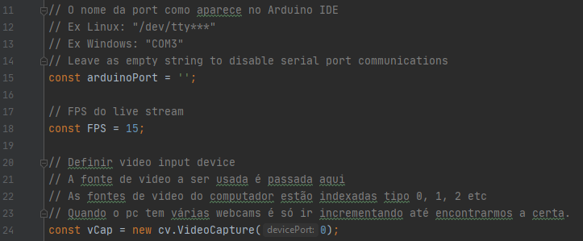
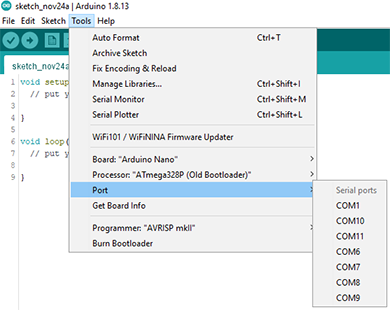

#### Este é o código server side, que incluí o serviço chat e o webcam stream.
Código do Arduino está [neste repo](https://github.com/makerspaceafa/webled-arduino).

## Instalação

### Requirements
- [Node.js](https://nodejs.org/)
- [CMake](https://cmake.org/download/) (required to build opencv4nodejs)

#### Windows
- Instalar Node.js
- Instalar CMake
- Fazer clone do repo / descarregar o projeto
- Dentro do projeto correr os seguintes comandos:
  - `npm install --global windows-build-tools`
  - `npm install`
#### Linux & etc
- `sudo apt install nodejs cmake` (ou o teu package manager)
- `git clone https://github.com/makerspaceafa/webled-server.git`
- `cd webled`
- `npm install`

## Configuração
No ficheiro *main.js*:  
Obrigatório definir arduinoPort e devicePort!  
  

Uma maneira fácil de descobrir em que port está o Arduinio é usar o Arduino IDE, que normalmente reconhece automaticamente e avisa:  
  

## Correr
Se chegaste até aqui sem problemas parabéns!  
Se chegaste até aqui depois de resolver os problemas todos que apareceram sozinh@, ainda mais de parabéns estás!

Agora basta o comando `node main.js` dentro do project folder!